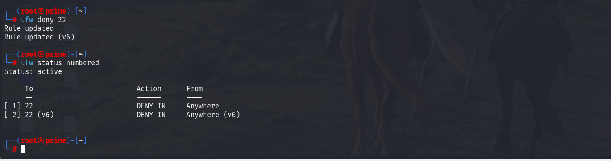
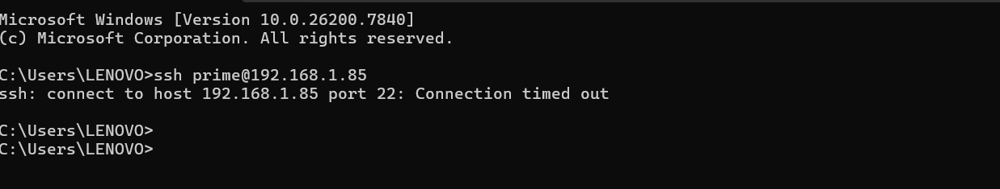
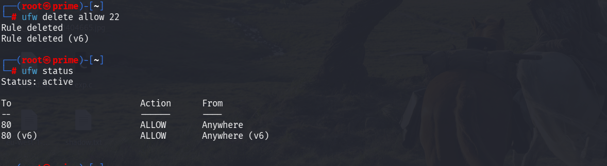

# Task-4-setup-and-configure-firewall-rules
setup and configure firewall rules on linux machine using ufw filrewall

UFW:Uncomplicated Firewall (UFW) is a user-friendly firewall management tool used in Linux systems, especially Ubuntu, to control incoming and outgoing network traffic. It acts as a frontend for iptables, allowing users to create and manage firewall rules using simple and easy-to-understand commands instead of complex configurations. UFW helps secure a system by filtering traffic based on ports, IP addresses, and protocols such as TCP and UDP. It supports both IPv4 and IPv6, allows setting default security policies (like denying all incoming connections), provides logging features for monitoring traffic, and includes predefined application profiles for common services like SSH and web servers. Overall, UFW makes firewall configuration simple while maintaining strong network security.

# 🔐 How Firewall Filters Traffic (Concept Explanation)

A firewall works as a **network traffic filter**.

It checks:

* Source IP
* Destination IP
* Port number
* Protocol (TCP/UDP)

### 🔹 How UFW Filters Traffic:

1. Incoming packet arrives.
2. Firewall checks rules from top to bottom.
3. If rule matches → Action taken (ALLOW / DENY).
4. If no rule matches → Default policy applies.

Example:

* If rule says **deny port 23**, all traffic targeting port 23 is blocked.
* If rule says **allow port 22**, SSH traffic is permitted.


## ✅ Step 1: Check if UFW is Installed

```bash
sudo ufw status
```
 

If not installed:

```bash
sudo apt install ufw
```


Enable UFW:

```bash
sudo ufw enable
```


---

## ✅ Step 2: List Current Firewall Rules

```bash
sudo ufw status verbose
```

or numbered list:

```bash
sudo ufw status numbered
```


This shows:

* Active status
* Default policies
* Allowed/blocked ports

---
## ✅ Step 3: Add rule for allow port 22(sssh) trafic 22 (ssh)

```bash
sudo ufw allow 22
```


## ✅ Step 4: Block Inbound Traffic on Port 22 (ssh)

Port **22** is used for secure remote shell connection (secure protocol).

Add rule:

```bash
sudo ufw deny 22
```



You should see:

```
22 DENY Anywhere
```

---

## ✅ Step 5: Test the Rule

### 🔹 Local Test:

Try connecting:

```bash
ssh prime@192.168.1.85
```



## ✅ Step 6: Remove the Test Block Rule (Restore State): we can two in two way first in using rule number and second is extact rule 

 ## Method 1:directly when we know the rule :

```bash
sudo ufw delete deny 21
```

Verify again:

```bash
sudo ufw status
```



## method 2: 
First check rule number:

```bash
sudo ufw status numbered
```

Example output:

```
[ 1] 23 DENY Anywhere
```

Delete rule:

```bash
sudo ufw delete 1
```


Port 23 rule should be removed.

---

# 📄 Documentation Summary

### Commands Used:

* `sudo ufw enable`
* `sudo ufw status verbose`
* `sudo ufw allow 22`
* `ssh username@ip`
* `sudo ufw deny 22`
* `sudo ufw delete deny 23`

---


## 🔐 Conclusion

In this task, we successfully set up and configured firewall rules on a Linux machine using **UFW (Uncomplicated Firewall)**. UFW makes firewall management simple by providing easy commands instead of complex iptables configurations.

We performed the following:

* Checked UFW status and enabled it.
* Viewed current firewall rules.
* Allowed SSH traffic on port 22.
* Blocked inbound traffic on port 22 to test security control.
* Verified the rule by attempting an SSH connection.
* Removed the test rule to restore normal configuration.

Through this practical implementation, we understood how a firewall filters network traffic based on ports, IP addresses, and protocols. We also learned how default policies and rule order affect traffic filtering.

Overall, UFW provides a simple yet powerful way to secure a Linux system by controlling incoming and outgoing connections, helping protect the system from unauthorized access and network-based attacks.

✅ Task Completed Successfully.


